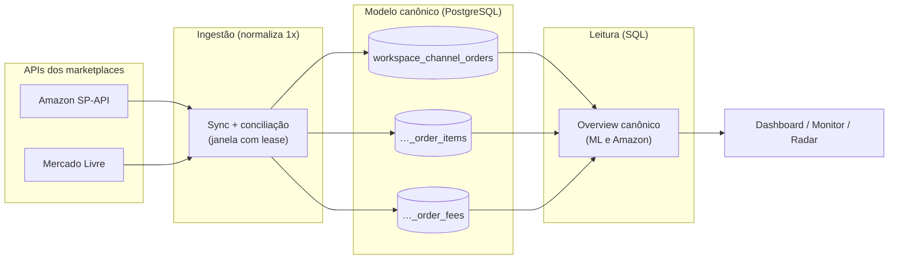
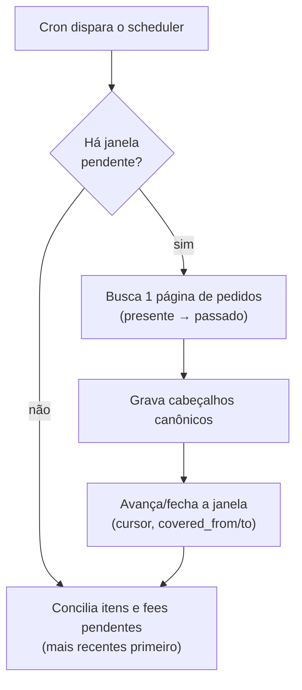
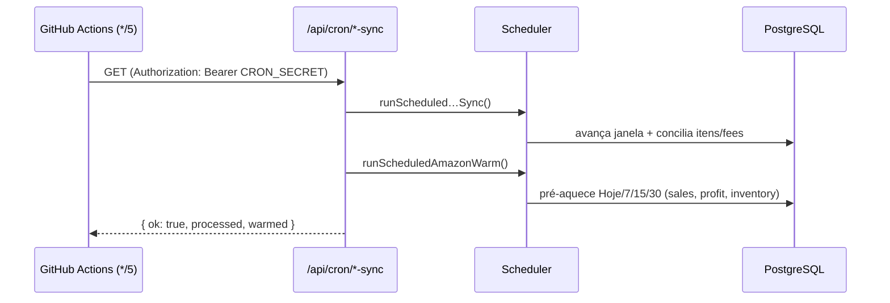
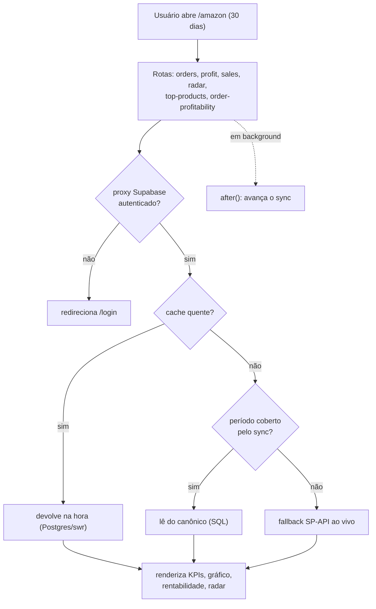

# Arquitetura do SellerCore

> Plataforma multicanal de inteligência de vendas (Amazon, Mercado Livre e futuros
> canais) em **Next.js 16 / React 19**, com dados isolados por *workspace* e um
> **modelo canônico único** para o qual todos os marketplaces convergem.

Este documento explica **como os dados entram, onde ficam e como chegam à tela** —
o coração da plataforma. Para funcionalidades e setup, veja o [README](./README.md);
para o esquema de tabelas em detalhe, [`docs/canonical-schema.md`](./docs/canonical-schema.md).

---

## 1. A ideia central

Cada marketplace tem uma API diferente, com semânticas diferentes de pedido, taxa e
frete. Em vez de espalhar essa complexidade pela aplicação inteira, o SellerCore a
**normaliza uma vez, na ingestão**, gravando tudo em tabelas canônicas comuns
(`workspace_channel_*`). A partir daí, dashboard, monitor, radar e lucro são só
**consultas SQL** sobre um formato único — rápidas, e iguais para todo canal.

**Princípio de replicação:** toda mudança de produto vale para **todos** os canais,
salvo quando é específica de um marketplace. Canais novos (TikTok, Shopee) já nascem
canônicos.

---

## 2. Stack

| Camada | Tecnologia |
|---|---|
| App / rotas | Next.js 16 (App Router, Turbopack), React 19, Tailwind 4 |
| Dados | PostgreSQL (Supabase), acesso direto via `pg` |
| Auth / multi-tenant | Supabase Auth (SSR) + isolamento por `workspace` |
| Contexto de request | `AsyncLocalStorage` (workspace + conta do marketplace) |
| Deploy | **Render** (web service + disco persistente) |
| Agendamento | **GitHub Actions** batendo nos endpoints de cron |

---

## 3. O modelo canônico

O centro de tudo. Tabelas *provider-agnostic* — a coluna `provider` (`amazon`,
`mercado_livre`, …) distingue o canal; `workspace_id` isola o cliente; `connection_id`
isola a conta dentro do canal (ex.: `amazon:<sellerId>`).

| Tabela | Papel |
|---|---|
| `workspace_channel_orders` | Cabeçalho do pedido: status canônico, `occurred_at`, `gross`, `currency`, `buyer_shipping`, `fulfillment`. |
| `workspace_channel_order_items` | Linhas do pedido: `sku`, `external_product_id`, `qty`, `unit_price` (líquido de promoção). |
| `workspace_channel_order_fees` | Taxas por pedido, agregadas por categoria canônica. |
| `workspace_marketplace_syncs` | Estado do sync por conta (janela, cursor, cobertura, lease). |
| `workspace_marketplace_products` | Catálogo/anúncios (payload pequeno, ainda por canal). |
| `workspace_product_costs` | Custo do produto **com histórico de vigência**. |
| `workspace_persistent_cache` | Cache stale-while-revalidate em produção. |

**Status canônico** (único para todos): `pending`, `paid`, `shipped`, `delivered`,
`cancelled`. Cada canal mapeia o seu (ex.: Amazon `Unshipped → paid`, `Shipped → shipped`).

**Taxonomia de fees** (único): `commission`, `fulfillment` (ex.: taxas FBA), `shipping_seller`,
`taxes_withheld`, `refund`, `other`. Sinal positivo = debitado do vendedor. O código
original da fee fica preservado em `provider_fee_code`.

**Decisões-chave:** o custo do produto é resolvido **na consulta** (por vigência),
não na ingestão; taxas são agregadas por pedido; e a escrita canônica é *best-effort*
e atômica (um statement com CTEs).

---

## 4. Ingestão — o padrão de sync

Mesmo desenho para todo canal (`amazonSync.ts`, `mercadoLivreScheduler.ts`):

- **Janela deslizante com lease.** O estado vive em `workspace_marketplace_syncs`. O
  sync caminha **do presente para o passado** em janelas (Amazon: 7 dias), guardando o
  cursor/`NextToken`. Um `lease_until` evita dois processos na mesma conta.
- **Conciliação em background.** O cabeçalho do pedido chega rápido (lista de pedidos);
  os **itens** e as **fees** chegam depois (chamadas por pedido, rate-limitadas),
  priorizando os mais recentes. Até os itens chegarem, `gross` usa o total do pedido
  como aproximação.
- **Cobertura sem extrapolar.** `covered_from`/`covered_to` marcam a janela já
  importada. Nada é "estimado" para além do que foi realmente apurado — a UI mostra
  avisos honestos de cobertura (ex.: *"cobre 1000 de 6476 vendas, sem extrapolar"*).

---

## 5. Leitura — overview canônico

Em vez de N rotas batendo em N endpoints da SP-API, a leitura vira **agregação SQL**
sobre as tabelas canônicas (`mercadoLivreOverviewCanonical.ts`,
`amazonOverviewCanonical.ts`): totais do período, série diária, top produtos,
rentabilidade por venda (com rateio de taxa/frete por peso de receita) e radar —
tudo com colunas indexadas, sem trafegar `jsonb`.

- **Mercado Livre:** já é **100% canônico**.
- **Amazon:** em migração (fase 5). Estratégia **híbrida** para não quebrar a
  reconciliação com o Seller Central enquanto o backfill amadurece:

| Dado | Fonte | Motivo |
|---|---|---|
| Faturamento + série diária | **Sales API** (`orderMetrics`) | Bate ao centavo com o Seller Central |
| KPI de Lucro | **Transactions API** (agregado) | Fonte reconciliada; mantida até validar o canônico |
| Rentabilidade por venda, radar, top produtos | **Canônico** quando `covered=true`, senão **fallback** à SP-API | SQL rápido; sem regressão durante o backfill |

O selo `covered` é o interruptor: período coberto pelo sync → lê do canônico; ainda
não coberto → cai no caminho ao vivo. Assim a troca é gradual e reversível.

---

## 6. Cache — stale-while-revalidate

Três camadas que se complementam (`cache.ts`, `swr.ts`, `persistentCache.ts`):

1. **`cached()`** — cache em memória com **dedupe**: várias rotas pedindo o mesmo dado
   no mesmo instante compartilham uma única chamada (não estoura o rate limit).
   Namespaced por `workspace | conta`.
2. **`swr()`** — *stale-while-revalidate* persistido no **PostgreSQL**
   (`workspace_persistent_cache`): fresco → devolve na hora; vencido → devolve o velho
   e revalida em segundo plano; sem cache + `awaitIfEmpty` → aguarda a busca real.
3. **`persistentCache`** — em produção grava no Postgres (sobrevive a restart); no dev,
   em arquivo.

> É por isso que a **primeira** carga de um período é lenta (cache frio → chamada real)
> e as seguintes são instantâneas. O aquecimento (§7) existe justamente para o usuário
> nunca pagar esse custo frio.

---

## 7. Agendamento — o cron

O sync e o aquecimento precisam rodar **sem depender de visita** ao dashboard.

> ⚠️ **Pegadinha do deploy:** os crons declarados em `vercel.json` **só funcionam na
> Vercel**. Como o SellerCore roda no **Render**, esse arquivo é ignorado — sem um
> agendador externo, nada dispara em background.

**Solução:** um workflow do **GitHub Actions** (`.github/workflows/cron.yml`) bate a
cada ~5 min nos endpoints que já existem, autenticado por `CRON_SECRET`:

- **Sync** (`amazonScheduler.ts`): avança o backfill e a conciliação das contas que
  precisam de trabalho.
- **Aquecimento** (`amazonWarm.ts`): para **todas** as contas ativas, pré-carrega os
  caches dos períodos do filtro (Hoje/7/15/30) — inclusive o KPI de Lucro — para a
  primeira visita já vir quente.

Segredos necessários: `CRON_SECRET` (no Render **e** no GitHub) e `APP_BASE_URL`
(no GitHub). Os endpoints se protegem sozinhos com esse segredo.

---

## 8. Contexto e isolamento

Toda request passa por duas camadas de escopo, via `AsyncLocalStorage`:

- **Workspace** — o proxy do Supabase (`src/lib/supabase/proxy.ts`) valida a sessão SSR;
  rotas não-públicas sem login recebem `401`. As `publicPaths` liberam `/login`,
  `/auth/confirm`, `/api/health`, `/api/cron/*` (protegidas por `CRON_SECRET`) e os
  webhooks. O `workspace_id` sai das claims do usuário.
- **Conta do marketplace** — no caso da Amazon, a conta ativa vem do cookie
  `active_seller` (ou da única conta cadastrada); `runWithAccount` injeta o
  `refreshToken` para as chamadas SP-API. Tudo — contas, custos, caches — é sempre
  escopado por `workspace | conta`.

---

## 9. Fluxo de uma visita ao dashboard Amazon

Cada visita também **empurra o sync** em `after()` (fora da resposta), então o
canônico amadurece mesmo sem o cron.

---

## 10. Mapa de arquivos

| Área | Arquivos |
|---|---|
| Cliente SP-API | `src/lib/spapi.ts` (token LWA, erros tipados `SpApiError`) |
| Auth / workspace | `src/lib/supabase/proxy.ts`, `workspaceContext.ts`, `workspaceScope.ts` |
| Contexto Amazon | `accountContext.ts`, `accountStore.ts`, `withAccount.ts` |
| Cache | `cache.ts`, `swr.ts`, `persistentCache.ts` |
| Canônico — ingestão | `integrations/amazonSync.ts`, `amazonCanonical.ts`, `canonicalStore.ts`, `canonical.ts` |
| Canônico — leitura | `integrations/mercadoLivreOverviewCanonical.ts`, `amazonOverviewCanonical.ts` |
| Agendamento | `integrations/amazonScheduler.ts`, `amazonWarm.ts`, `.github/workflows/cron.yml`, `src/app/api/cron/*` |
| Domínio (ao vivo) | `orders.ts`, `finances.ts`, `transactions.ts`, `sales.ts`, `inventory.ts`, `radar.ts`, `profit.ts`, `topProducts.ts`, `amazonProfitability.ts`, `profitability.ts`, `costStore.ts` |
| Rotas | `src/app/api/*` |
| UI | `src/app/{page,amazon,mercado-livre,monitor,estoque,produtos,pesquisa}` + `components/` |

---

## 11. Estado da migração canônica

| Fase | Escopo | Status |
|---|---|---|
| 1–4 | Schema canônico + ML (ingestão, backfill, overview por SQL) | ✅ concluída |
| 5A | Leitor canônico da Amazon (`amazonOverviewCanonical.ts`) | ✅ concluída |
| 5B | Rotas Amazon (radar, top-products, rentabilidade) lêem do canônico com fallback | ✅ concluída |
| 5C | Cron no Render (GitHub Actions) + aquecimento de cache | ✅ concluída |
| 5D | Validar números canônicos vs Seller Central; aposentar o caminho ao vivo | ⏳ pendente |

Detalhes e decisões em [`docs/canonical-schema.md`](./docs/canonical-schema.md) e
[`docs/integrations-architecture.md`](./docs/integrations-architecture.md).
