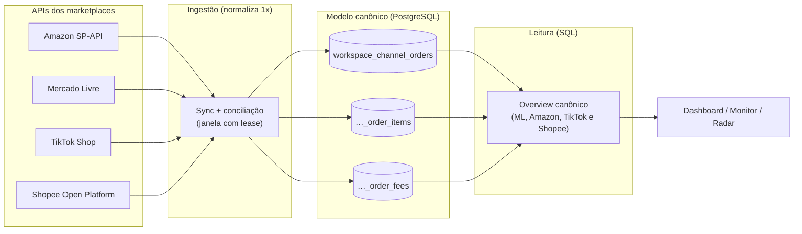
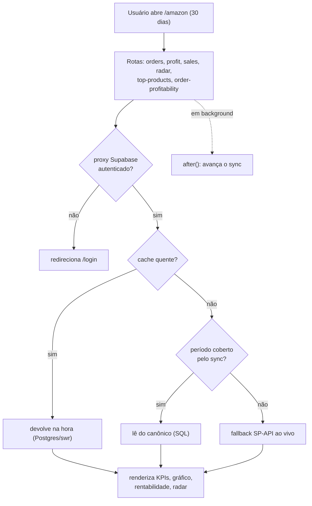

# SellerCore — Visão geral da arquitetura

> Plataforma multicanal de inteligência de vendas (Amazon, Mercado Livre, TikTok Shop
> e Shopee) em **Next.js 16 / React 19**, com dados isolados por *workspace* e um
> **modelo canônico único** para o qual todos os marketplaces convergem.

Este é o **ponto de entrada** da arquitetura: como os dados entram, onde ficam e
como chegam à tela. Aprofunde nos docs focados:

- [`canonical-model.md`](./canonical-model.md) — o modelo canônico (conceito) → detalhe em [`../canonical-schema.md`](../canonical-schema.md)
- [`sync-engine.md`](./sync-engine.md) — ingestão (sync) + agendamento (cron)
- [`read-and-cache.md`](./read-and-cache.md) — leitura por SQL + cache stale-while-revalidate
- Decisões e trade-offs: [`../adr/`](../adr/)

Para funcionalidades e setup, veja o [README](../../README.md).

---

## 1. A ideia central

Cada marketplace tem uma API diferente, com semânticas diferentes de pedido, taxa e
frete. Em vez de espalhar essa complexidade pela aplicação inteira, o SellerCore a
**normaliza uma vez, na ingestão**, gravando tudo em tabelas canônicas comuns
(`workspace_channel_*`). A partir daí, dashboard, monitor, radar e lucro são só
**consultas SQL** sobre um formato único — rápidas, e iguais para todo canal.

**Princípio de replicação:** toda mudança de produto vale para **todos** os canais,
salvo quando é específica de um marketplace. TikTok e Shopee foram desenhados para
nascer canônicos; no TikTok, ingestão, cron, overview e módulos já estão
implementados. Isso não equivale a conciliação financeira completa: os parsers de
pedidos/produtos foram confrontados com amostras reais, mas a validação financeira
real e a cobertura de categorias de settlement seguem parciais.
Na Shopee, sync, persistência, cron, overview e módulos também estão implementados
e testados em sandbox; a confrontação com respostas Live depende da aprovação do
Go Live, de credenciais de produção e de uma loja real autorizada.

---

## 2. Stack

| Camada | Tecnologia |
|---|---|
| App / rotas | Next.js 16 (App Router, Turbopack), React 19, Tailwind 4 |
| Dados | PostgreSQL (Supabase), acesso direto via `pg` |
| Auth / multi-tenant | Supabase Auth (SSR) + isolamento por `workspace` |
| Contexto de request | `AsyncLocalStorage` (workspace + conta do marketplace) |
| Deploy | **Render** (web service + disco persistente) |
| Agendamento | **GitHub Actions** batendo nos endpoints de cron |

---

## 3. Contexto e isolamento

Toda request passa por duas camadas de escopo, via `AsyncLocalStorage`:

- **Workspace** — o proxy do Supabase (`src/lib/supabase/proxy.ts`, exposto como
  `src/proxy.ts` no Next 16) valida a sessão SSR; rotas não-públicas sem login
  recebem `401`. As `publicPaths` liberam `/login`, `/auth/confirm`, `/api/health`,
  `/api/cron/*` (protegidas por `CRON_SECRET`) e os webhooks. O `workspace_id` sai
  das claims do usuário.
- **Conta do marketplace** — no caso da Amazon, a conta ativa vem do cookie
  `active_seller` (ou da única conta cadastrada); `runWithAccount` injeta o
  `refreshToken` para as chamadas SP-API. Tudo — contas, custos, caches — é sempre
  escopado por `workspace | conta`.

---

## 4. Fluxo de uma visita ao dashboard Amazon

Cada visita também **empurra o sync** em `after()` (fora da resposta), então o
canônico amadurece mesmo sem o cron.

---

## 5. Mapa de arquivos

| Área | Arquivos |
|---|---|
| Cliente SP-API | `src/lib/spapi.ts` (token LWA, erros tipados `SpApiError`) |
| Auth / workspace | `src/lib/supabase/proxy.ts`, `workspaceContext.ts`, `workspaceScope.ts` |
| Contexto Amazon | `accountContext.ts`, `accountStore.ts`, `withAccount.ts` |
| Cache | `cache.ts`, `swr.ts`, `persistentCache.ts` |
| Canônico — ingestão | `integrations/amazonSync.ts`, `amazonCanonical.ts`, `tiktokSync.ts`, `tiktokCanonical.ts`, `shopeeSync.ts`, `shopeeCanonical.ts`, `canonicalStore.ts`, `canonical.ts` |
| Canônico — leitura | `integrations/mercadoLivreOverviewCanonical.ts`, `amazonOverviewCanonical.ts`, `tiktokOverviewCanonical.ts`, `shopeeOverviewCanonical.ts` |
| Agendamento | `integrations/amazonScheduler.ts`, `amazonWarm.ts`, `tiktokScheduler.ts`, `shopeeScheduler.ts`, `.github/workflows/cron.yml`, `src/app/api/cron/*` |
| Anúncio (Ads) | `integrations/amazonAdsAuth.ts` (OAuth + token cifrado), `amazonAdsSync.ts` (pedir/colher/resumir), `app/amazon/amazonFinancialCards.ts` (Ads, ACOS, TACOS e o lucro que os desconta) |
| Domínio (ao vivo) | `orders.ts`, `finances.ts`, `transactions.ts`, `sales.ts`, `inventory.ts`, `radar.ts`, `profit.ts`, `topProducts.ts`, `amazonProfitability.ts`, `profitability.ts`, `costStore.ts` |
| Rotas | `src/app/api/*` |
| UI | `src/app/{page,amazon,mercado-livre,monitor,estoque,produtos,pesquisa}` + `components/` |

---

## 6. Estado da migração canônica

| Fase | Escopo | Status |
|---|---|---|
| 1–4 | Schema canônico + ML (ingestão, backfill, overview por SQL) | ✅ concluída |
| 5A | Leitor canônico da Amazon (`amazonOverviewCanonical.ts`) | ✅ concluída |
| 5B | Rotas Amazon (radar, top-products, rentabilidade) lêem do canônico com fallback | ✅ concluída |
| 5C | Cron no Render (GitHub Actions) + aquecimento de cache | ✅ concluída |
| 5D | Validar números canônicos vs Seller Central; aposentar o caminho ao vivo | ⏳ pendente |
| TikTok | OAuth, sync paginado, scheduler/cron, overview canônico e rotas de módulo | ✅ implementados e cobertos por testes; validação financeira real parcial |
| Shopee | OAuth, sync paginado, persistência canônica, scheduler/cron, overview e rotas de módulo | ✅ implementados e testados em sandbox; validação Live bloqueada pelo Go Live/credenciais/loja real |

Detalhes e decisões em [`../canonical-schema.md`](../canonical-schema.md) e
[`../integrations-architecture.md`](../integrations-architecture.md).
