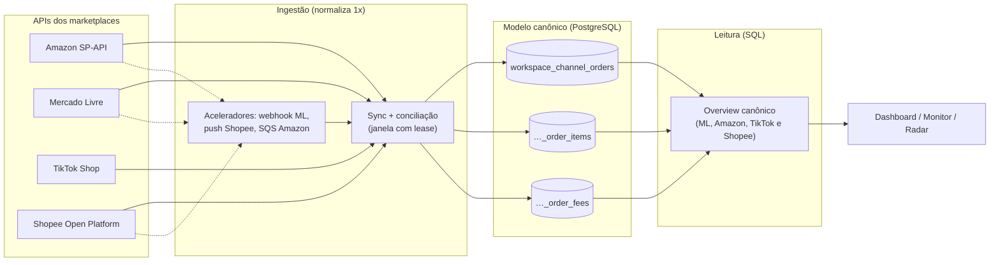
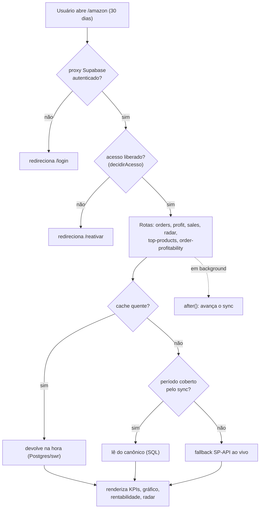

# NEXO — Visão geral da arquitetura

> Plataforma multicanal de inteligência de vendas (Amazon, Mercado Livre, TikTok Shop
> e Shopee) em **Next.js 16 / React 19**, com dados isolados por *workspace* e um
> **modelo canônico único** para o qual todos os marketplaces convergem.

Este é o **ponto de entrada** da arquitetura: como os dados entram, onde ficam e
como chegam à tela. Aprofunde nos docs focados:

- [`canonical-model.md`](./canonical-model.md) — o modelo canônico (conceito) → detalhe em [`../canonical-schema.md`](../canonical-schema.md)
- [`sync-engine.md`](./sync-engine.md) — ingestão (sync) + agendamento + aceleradores (webhook/push/SQS)
- [`read-and-cache.md`](./read-and-cache.md) — leitura por SQL + cache stale-while-revalidate
- Decisões e trade-offs: [`../adr/`](../adr/)

Para funcionalidades e setup, veja o [README](../../README.md). Para a foto de
onde cada frente parou, [`../estado-atual.md`](../estado-atual.md).

---

## 1. A ideia central

Cada marketplace tem uma API diferente, com semânticas diferentes de pedido, taxa e
frete. Em vez de espalhar essa complexidade pela aplicação inteira, o NEXO a
**normaliza uma vez, na ingestão**, gravando tudo em tabelas canônicas comuns
(`workspace_channel_*`). A partir daí, dashboard, monitor, radar e lucro são só
**consultas SQL** sobre um formato único — rápidas, e iguais para todo canal.

**Princípio de replicação:** toda mudança de produto vale para **todos** os canais,
salvo quando é específica de um marketplace — e replicar é reimplementar a
**garantia** com a API de cada canal, nunca copiar o mecanismo (ver `AGENTS.md`).
Os quatro canais têm ingestão, cron, overview e módulos implementados e servindo
tela. O que ainda **não** é paridade completa, medido em 26/09/2026:

- **TikTok:** a validação financeira real segue **parcial** — o ledger do primeiro
  cliente real está travado na janela de estreia (colisão entre a regra do
  mês-vigente e o extrato que liquida pedidos anteriores; detalhe e decisão
  pendente em [`sync-engine.md`](./sync-engine.md#5-tiktok-o-ledger-fail-closed-e-o-travamento-conhecido)).
- **Shopee:** a validação Live está cumprida — Go Live aprovado (02/09),
  credenciais de produção ativas, push assinado no ar e a conta real da UTILEIRA
  conciliada ao centavo contra o painel (04/09) — ver `estado-atual.md`. Resta
  operação (IP allowlist a reconferir a cada mudança de plano/região do Fly).

---

## 2. Stack

| Camada | Tecnologia |
|---|---|
| App / rotas | Next.js 16 (App Router, Turbopack), React 19, Tailwind 4 |
| Dados | PostgreSQL (Supabase), acesso direto via `pg` (pooler em modo transaction — ADR-028) |
| Auth / multi-tenant | Supabase Auth (SSR) + isolamento por `workspace` |
| Assinatura | `src/lib/billing/` — `decidirAcesso()` é a única fonte; gateway definido: **AbacatePay** (decisão de 23/09/2026; código Stripe permanece como sandbox legado até a troca) |
| Contexto de request | `AsyncLocalStorage` (workspace + conta do marketplace) |
| Deploy | **Fly.io** (`gru`, `https://nexoaihub.com.br` — ADR-015), por **worktree dedicado** + `scripts/fly-deploy.sh` |
| Agendamento | **Agendador interno no processo** (ADR-019, `src/instrumentation.ts`); `cron.yml` sobrevive só como gatilho manual de emergência |
| CI | `.github/workflows/testes.yml` — portão completo em todo push na `main` e PR |

---

## 3. Contexto e isolamento

Toda request passa por duas camadas de escopo, via `AsyncLocalStorage`:

- **Workspace** — o proxy do Supabase (`src/lib/supabase/proxy.ts`, exposto como
  `src/proxy.ts` no Next 16) valida a sessão SSR; rotas não-públicas sem login
  recebem `401`. As `publicPaths` liberam as telas públicas (`/login`,
  `/recuperar-senha`, `/landing`, `/termos`, `/privacidade`, `/reativar`),
  `/auth/confirm`, `/api/health`, `/api/cron/*` (protegidas por `CRON_SECRET`) e
  os webhooks (cada um com a própria autenticação — ver §4). O `workspace_id`
  sai **só** das claims do usuário (`workspaceContext.ts`); nenhuma rota o aceita
  por parâmetro.
- **Conta do marketplace** — no caso da Amazon, a conta ativa vem do cookie
  `active_seller` (ou da única conta cadastrada); `runWithAccount` injeta o
  `refreshToken` para as chamadas SP-API. Tudo — contas, custos, caches — é sempre
  escopado por `workspace | conta`.

As duas garantias de isolamento (falha alta sem escopo; `connection_id` do
cliente só estreita, nunca define) estão no `AGENTS.md` e são travadas por
`tests/workspaceIdNaoDependeDeLembranca`, `tests/workspaceScope` e
`tests-integracao/isolamentoEntreInquilinos`.

---

## 4. Superfícies de entrada — quem pode bater no app

Além das rotas autenticadas, quatro famílias de entrada têm autenticação própria:

| Superfície | Autenticação | O que faz |
|---|---|---|
| `/api/webhooks/mercado-livre` | `?token=` conferido contra `WEBHOOK_ML_TOKEN`; origem desconhecida recebe **404** (a rota "não existe" — mesma regra do `/admin`, ADR-024) | Enfileira o evento em `workspace_marketplace_events` e acelera o sync do recurso |
| `/api/webhooks/shopee` | Assinatura HMAC (`url\|corpo` com a Live Push Partner Key) | Push de pedido em ~11 s contra 3–15 min da varredura; carimba `last_push_at` (0031) |
| Amazon via **SQS** (ADR-023) | Não é rota HTTP: a rota interna `/api/cron/amazon-notifications` faz long-poll da fila AWS (~45 s por batida, redisparada a cada 20 s pelo agendador) | Consome `ORDER_CHANGE`, processa e **age** (frescor de pedido); a assinatura da notificação é feita automaticamente no connect de cada vendedor novo |
| `/api/webhooks/stripe` | Assinatura do evento | Sandbox legado da máquina de assinatura |
| `/api/cron/*` | `Bearer CRON_SECRET` | Rotas que o agendador interno chama via localhost |

📌 Regra transversal: **consulta sem escopo de workspace devolve agregado, nunca
identificador** (vigia do `/api/health`), e webhook nenhum confia no corpo — o
evento vira busca autenticada no marketplace, nunca escrita direta.

---

## 5. Superfícies de tela (front) — 26/09/2026

O app tem **três famílias de superfície**, e a diferença entre elas não é visual,
é de responsabilidade.

**1. Telas autenticadas — `src/app/(app)/`.** Route group, então o parêntese
**não entra na URL**: `(app)/amazon/page.tsx` continua servindo `/amazon`. Todo
canal tem a mesma árvore (dashboard, briefing, monitor, anúncios, estoque, ABC,
calculadora), e a central `/` é tela de passagem. Dois canais — Mercado Livre e
Amazon — montam o esqueleto **v3**; Shopee e TikTok seguem no desenho anterior, e
a réplica é por canal.

**2. Telas públicas — fora do group.** `/landing` (servida também na raiz por
rewrite), `/login`, `/recuperar-senha`, `/termos`, `/privacidade` e `/reativar`.
Não passam pela casca nem pela tranca.

**3. Bancadas.** `/mercado-livre/bancada*` monta a tela REAL com dado real (exige
sessão); `/lab/mercado-livre` e `/lab/amazon` montam o componente real com dado
FIXO, sem sessão e sem banco, e só existem em desenvolvimento (`isLab`, no
proxy). Bancada não é enfeite: foi a varredura do **DOM renderizado** de uma
delas que achou "Produto no FULL" dentro de um bloco já intitulado "Radar do
FBA" — grep no fonte não acharia.

### As peças compartilhadas do v3

`PainelV3` (faixa do período + Top de produtos + ritmo de 7 dias + o que falta),
`PainelV3Baixo` (Pedidos, Anúncios pagos, radar de estoque, repasse) e
`FaixaDoPeriodoV3`, que o `PainelV3` embrulha. Os dois canais montam as **mesmas
peças** — não cópias.

⚠️ **A peça é cega ao canal, e a palavra vem do contrato** (`src/lib/canalV3.ts`).
Toda palavra que muda de um marketplace para outro entra por campo
**obrigatório**, nunca `?:` — campo opcional deixa o segundo sítio esquecer em
silêncio. A Amazon exibiu "Tarifa ML", depois "Radar do FULL", depois "Produto no
FULL" dentro do "Radar do FBA": três vezes a mesma família em dois dias, e
nenhuma ficou vermelha, porque texto errado é texto válido. Um dos campos não é
palavra: `anuncioNoLucro` decide uma **afirmação** — no ML o gasto com anúncio
sai no fechamento; na Amazon ele já está dentro do lucro.

### A tranca de assinatura mora no layout do group

`src/app/(app)/layout.tsx` faz duas coisas, pelo mesmo motivo: é o ponto por onde
**toda** tela autenticada passa e por onde **nenhuma** tela pública passa.

- **A casca** (`AppShell`) saiu do layout raiz em 01/09. Antes, toda rota nascia
  envolvida e cada tela pública precisava se desinscrever por lista — defesa por
  enumeração protege o que alguém lembrou de escrever, e a rota seguinte nasce
  desprotegida. Medido antes da mudança: **6.663 bytes** de `<aside
  class="nexo-sidebar">` no HTML servido a um visitante anônimo, 42% do markup do
  body, com o nome de cada aba do produto.
- **A tranca** (07/09) lê `lerAcesso(workspaceId)` e redireciona para
  `/reativar?motivo=...` quando o acesso não está liberado.
  ⚠️ **A decisão não é tomada aqui**: vem de `billing/acesso.ts`
  (`decidirAcesso()`), a mesma função que `withAuthenticatedWorkspace` usa nas
  rotas de dado — antes disso, conta cortada recebia 403 no dado mas a navegação
  abria, e a pessoa via o produto inteiro cheio de erro em vez de ser levada à
  reativação. E o **sync pausa pela mesma decisão** — a equivalência
  acesso-cortado ⇄ sync-pausado é provada por
  `tests-integracao/acessoPausaSyncEquivale`.
  ⚠️ **Sem sessão ele não redireciona**: cada página manda para `/login` com o
  próprio `next=`, e assumir isso no layout apagaria o destino de volta.

### O padrão visual é um contrato com medidas, não um gosto

Regra permanente dela (10/09, verbatim): *"tenha isso como padrão, todas as novas
telas precisam seguir o padrão do dash principal"*. O contrato está escrito em
`src/app/globals.css`, num bloco próprio, e os números foram **medidos no
dashboard renderizado**:

- **cartão** `.v3-card` — borda 1px na tinta cheia, raio 12px, fundo branco;
- **faixa** `.v3-colunas` — sete trilhas fixas de 198×110px; tela com menos
  números deixa trilha vazia, **não estica**;
- **cabeçalho** `.v3-card-cab` — `<h2>` 15px/700 à esquerda, meta ou botão à
  direita;
- **tabela** — embrulho `.v3-tabela` com `subgrid`, colunas
  `minmax(<piso>, auto)` e nunca px cravado; `gap` e `min-width` no embrulho;
- **linha** ~29px, porque linha é alvo de ponteiro;
- **paginação** 15 por página, **fora** do cartão;
- **chip** verde/vermelho/laranja e **cinza para desconhecido, nunca zero**;
- **espaçamento** `gap: 20px` e `align-items: start` — vazio **dentro** de um
  cartão lê como "faltou carregar"; o mesmo espaço fora dele lê como respiro.

Tela que inventa a própria medida faz o app parecer vários produtos colados: foi
o que obrigou a refazer o bloco do custo no Full e a tela de estoque.

---

## 6. Fluxo de uma visita ao dashboard Amazon

Cada visita também **empurra o sync** em `after()` (fora da resposta), então o
canônico amadurece mesmo entre as batidas do agendador.

---

## 7. Deploy e portão de CI

**Deploy (Fly.io, ADR-015).** O `fly deploy` publica **a árvore do disco**, então
o ritual protege a árvore, não só o commit:

1. worktree dedicado **fora do repo** (`G:/nexo-deploy`), no commit exato a publicar;
2. **antes de todo checkout**: `git fetch origin` + `git rev-list --count
   HEAD..origin/main` **= 0** — regra de 22/09/2026, quando uma main local
   atrasada rebaixou produção por 15 minutos;
3. gates completos **no worktree** (`npm ci`, `tsc --noEmit`, `npm test`, build);
4. `bash scripts/fly-deploy.sh` — nunca `fly deploy` pelado: as `NEXT_PUBLIC_*`
   entram como `--build-arg` (sem elas o login quebra) e `DEPLOYMENT_VERSION`
   carimba o commit;
5. prova = **o carimbo do commit no `/api/health`** da máquina, nunca "release
   criado" (release pode ficar preso em `running` na versão velha);
6. `git push origin main` + `rev-list --count origin/main..main` = 0 — **o push
   fecha o ritual** (regra de 20/09, depois de o GitHub ficar 584 commits atrás).

**Portão de CI (`.github/workflows/testes.yml`, desde 30/08).** Em todo push na
`main` e todo PR: `tsc` → eslint → `npm test` (suíte completa) → **testes de
integração contra Postgres descartável em contêiner** (bootstrap + migrations
antes) → build de produção. `DATABASE_URL` fica deliberadamente indefinida no
job — nenhum passo alcança produção nem por engano. O portão estreou verde em
20/09 (run 35520489720) e desde então os testes de integração rodam em todo push,
não só na máquina de quem lembrou.

---

## 8. Mapa de arquivos

| Área | Arquivos |
|---|---|
| Cliente SP-API | `src/lib/spapi.ts` (token LWA, erros tipados `SpApiError`) |
| Auth / workspace | `src/lib/supabase/proxy.ts`, `workspaceContext.ts`, `workspaceScope.ts` |
| Assinatura / acesso | `src/lib/billing/` (`acesso.ts` é a decisão; `assinatura.ts`, `garantiaDeSeteDias.ts`, webhook Stripe legado) |
| Contexto Amazon | `accountContext.ts`, `accountStore.ts`, `withAccount.ts` |
| Cache | `cache.ts`, `swr.ts`, `persistentCache.ts` |
| Canônico — ingestão | `integrations/amazonSync.ts`, `amazonCanonical.ts`, `mercadoLivreScheduler.ts`, `tiktokSync.ts`, `tiktokCanonical.ts`, `shopeeSync.ts`, `shopeeCanonical.ts`, `canonicalStore.ts`, `canonical.ts` |
| Canônico — leitura | `integrations/mercadoLivreOverviewCanonical.ts`, `amazonOverviewCanonical.ts`, `tiktokOverviewCanonical.ts`, `shopeeOverviewCanonical.ts`, `lucroPorDiaDaAmazon.ts` |
| Agendamento | `src/instrumentation.ts` (agendador interno, ADR-019), `integrations/cadenciaDoSync.ts` (cadência única por canal), `amazonScheduler.ts`, `mercadoLivreScheduler.ts`, `tiktokScheduler.ts`, `tiktokFinancialScheduler.ts`, `shopeeScheduler.ts`, `amazonWarm.ts`, `src/app/api/cron/*` |
| Aceleradores (push) | `src/app/api/webhooks/{mercado-livre,shopee}/route.ts`, `integrations/mercadoLivreNotification.ts`, `amazonSqs.ts`, `amazonNotificacoes.ts`, `amazonNotificacaoSetup.ts` |
| Vigia / métricas | `integrations/defasagemDoSync.ts` (agregado por canal no `/api/health`), `src/lib/metricas.ts` (porta interna 9091) |
| Anúncio (Ads) | `integrations/amazonAdsAuth.ts` (OAuth + token cifrado), `amazonAdsSync.ts` (pedir/colher/resumir), `anuncioDoCanal.ts` (gasto por dia com autoridade da tabela de campanha) |
| Tarifa estimada | `integrations/amazonTarifaEstimada.ts` (observada > tabela > api, ADR-027/030), `amazonTabelaDeComissao.ts`, `amazonTabelaDeFba.ts` |
| Domínio (ao vivo) | `orders.ts`, `finances.ts`, `transactions.ts`, `sales.ts`, `inventory.ts`, `radar.ts`, `profit.ts`, `topProducts.ts`, `amazonProfitability.ts`, `profitability.ts`, `costStore.ts`, `amazonBalance.ts` |
| Contrato do front v3 | `src/lib/canalV3.ts` (palavras e afirmações por canal, campos obrigatórios) |
| Rotas | `src/app/api/*` |
| UI | `src/app/(app)/{page,amazon,mercado-livre,shopee,tiktok,monitor,estoque,produtos,pesquisa}` + telas públicas fora do group + `components/` |

---

## 9. Estado da migração canônica

| Fase | Escopo | Status |
|---|---|---|
| 1–4 | Schema canônico + ML (ingestão, backfill, overview por SQL) | ✅ concluída — ML é 100% canônico |
| 5A–5C | Leitor canônico da Amazon + rotas com fallback + cron/aquecimento | ✅ concluída |
| 5D | Aposentar o caminho ao vivo da Amazon | ⏳ parcial — faturamento/KPI de lucro seguem híbridos ([read-and-cache](./read-and-cache.md)); lucro por dia, top produtos e rentabilidade já são canônicos no v3 |
| TikTok | OAuth (app público único), sync paginado, scheduler/cron, overview canônico e rotas de módulo | ✅ implementados e com cliente real conectado; validação financeira real parcial (ledger travado — ver [sync-engine](./sync-engine.md)) |
| Shopee | OAuth, sync paginado, persistência canônica, scheduler/cron, overview e rotas de módulo | ✅ implementados e com validação Live cumprida (Go Live aprovado 02/09; credenciais de produção; conta real ao centavo em 04/09) |

Detalhes e decisões em [`../canonical-schema.md`](../canonical-schema.md) e
[`../integrations-architecture.md`](../integrations-architecture.md).

---

## Changelog

- **26/09/2026** — Atualização geral medida contra `git log 25/08..HEAD` e o
  código (o doc estava congelado em 25/08): deploy Render→Fly por worktree com
  fetch-antes-do-checkout, agendador interno no lugar do cron do Actions, portão
  de CI, superfícies de entrada (webhook ML com token, push Shopee, SQS Amazon),
  superfícies de tela v3 + tranca de assinatura (bloco da Vitrine, medido em
  26/09), AbacatePay como gateway definido, mapa de arquivos e fases.
- **25/08/2026** — Versão anterior (Render + cron por GitHub Actions).
