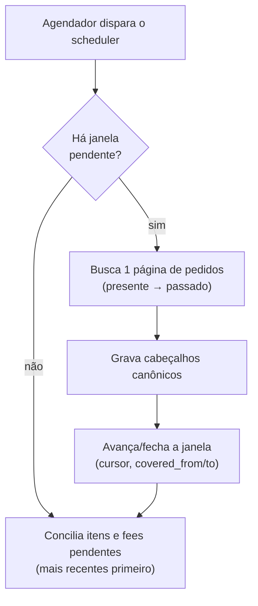
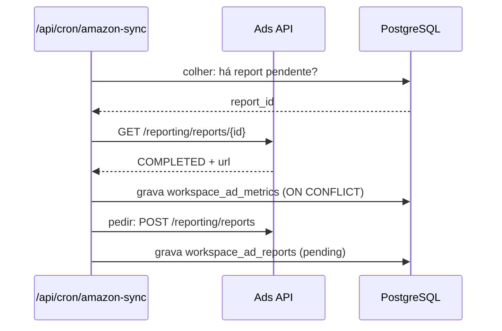

# Motor de sync (ingestão + agendamento)

> Como os dados **entram** no modelo canônico e como o processo roda em background.
> Decisão do agendador: [`ADR-019`](../adr/ADR-019-agendador-interno.md) (que
> substituiu o cron por GitHub Actions do
> [`ADR-003`](../adr/ADR-003-cron-github-actions.md)).

## 1. O padrão de sync

O desenho de janela, cursor e lease é compartilhado pelos canais implementados
(`amazonSync.ts`, `mercadoLivreScheduler.ts`, `tiktokSync.ts`,
`tiktokScheduler.ts`, `shopeeSync.ts` e `shopeeScheduler.ts`). Os detalhes e
limites da API continuam específicos de cada adaptador.

- **Janela deslizante com lease.** O estado vive em `workspace_marketplace_syncs`. O
  sync caminha **do presente para o passado** em janelas (Amazon: 7 dias), guardando o
  cursor/`NextToken`. Um `lease_until` evita dois processos na mesma conta, com
  **fencing por token** nos quatro canais (checkpoint só grava se o lease ainda é seu).
- **Conciliação em background.** O cabeçalho do pedido chega rápido (lista de pedidos);
  os **itens** e as **fees** chegam depois (chamadas por pedido, rate-limitadas),
  priorizando os mais recentes. Até os itens chegarem, `gross` usa o total do pedido
  como aproximação.
- **Cobertura sem extrapolar.** `covered_from`/`covered_to` marcam a janela já
  importada. Nada é "estimado" para além do que foi realmente apurado. A exceção
  nomeada é a tarifa estimada da Amazon (ADR-027/ADR-030): número publicado pela
  própria fonte, substituído na liquidação — nunca média nossa.
- **Reeleição após erro.** Conexão em `error` volta a ser candidata depois de um
  backoff (ML 15 min, Shopee 5, Amazon 30) — erro transitório não pode prender a
  conta para sempre (incidente de 28/08, `estado-atual.md` §15).

### 1.1 Estreia = mês vigente (regra da dona, 27/08/2026)

Conta nova importa **o mês vigente** — quem conecta no dia 17 vê os 17 dias do
mês até ali, e o histórico cresce para frente, **sem aprofundamento retroativo
em background**. A semente única por canal é
`src/lib/integrations/inicioDoMes.ts` (fuso de Brasília). No TikTok, por
exemplo, `tiktokSeedSyncWindow` (`tiktokSyncControl.ts`) semeia
`targetFromMs = início do mês` e a janela de pedidos anda para trás em passos de
15 dias até alcançar o alvo. O sync imediato pós-conexão dispara no callback via
`after()`, fura a fila e mostra número na tela em 1–2 minutos.

⚠️ **Consequência que o leitor precisa levar para o ledger:** uma conexão nova
**não tem pedido anterior ao dia 1º do mês em que entrou** — e nunca vai ter.
Um extrato financeiro pode liquidar exatamente esses pedidos — ver §5 (TikTok).

## 2. Agendamento — o agendador interno (ADR-019)

O gatilho principal é o **próprio processo do app**: `src/instrumentation.ts`
(gancho `register` do Next.js), armado por `INTERNAL_SCHEDULER=1`, chama as
rotas de cron **via localhost** com `CRON_SECRET` — reusa timeout, idempotência
e leases que as rotas já têm. O `cron.yml` do GitHub Actions ficou como
**gatilho manual de emergência** (`workflow_dispatch`) desde 21/08, quando a
cota do Actions estourou e o agendador interno segurou o sync sozinho.

**A cadência por canal mora num lugar só** — `integrations/cadenciaDoSync.ts` —
porque o vigia de defasagem deriva o limite de alarme dela (limiar no código,
não no painel; ver `AGENTS.md`). Os intervalos são **medidos** contra o ritmo
real de chegada de pedido (29/08/2026):

| canal | rota | pedidos/hora medidos | intervalo |
|---|---|---:|---:|
| Shopee | `/api/cron/shopee-sync` | 14,1 | 3 min |
| Mercado Livre | `/api/cron/mercado-livre-sync` | 6,5 | 5 min |
| TikTok Shop | `/api/cron/tiktok-sync` | 2,8 | 10 min |
| Amazon | `/api/cron/amazon-sync` | 1,8 | 10 min |

O ML leva 5 e não 10 porque tem webhook: o urgente chega por lá. Os canais são
escalonados 30 s entre si; uma execução por rota por vez no processo; retenção
(ADR-016) uma vez por dia. Alarme: **5 ciclos perdidos** (`CICLOS_ATE_ALARMAR`),
agregado por canal no `/api/health` (`defasagemDoSync.ts` — sem `connection_id`
na saída, regra de 02/09) e exportado como métrica ao lado do limite.

Freios operacionais: `SCHEDULER_CANAIS` religa canal a canal depois de um
incidente; `SCHEDULER_SYNC_INTERVAL_MS` força intervalo único (uso de teste).

## 3. Aceleradores — push por canal, varredura como rede de segurança

A varredura (§1–2) é o chão: alcança a conta inteira a cada ciclo. O push só
**acelera o recente** — remover a varredura porque "o push está entregando" é o
defeito das 11 horas de 03/09 (`AGENTS.md`, "coluna que dois escritores tocam").
Cada canal tem o seu mecanismo, porque cada API entrega diferente:

| Canal | Mecanismo | Autenticação | Efeito |
|---|---|---|---|
| Mercado Livre | webhook `/api/webhooks/mercado-livre` | `?token=` vs `WEBHOOK_ML_TOKEN`; origem desconhecida → **404** (desde 07/09, v287) | evento entra em `workspace_marketplace_events` e vira busca autenticada do recurso |
| Shopee | push `/api/webhooks/shopee` | HMAC `url\|corpo` (Live Push Partner Key) | pedido no canônico com latência mediana **10,8 s**; carimba `last_push_at` (0031), nunca `last_success_at` |
| Amazon | **SQS** (ADR-023, 21/09) — não há webhook HTTP: a Amazon só entrega em SQS/EventBridge | rota `/api/cron/amazon-notifications` faz long-poll da fila (~45 s), redisparada a cada 20 s pelo agendador | consome `ORDER_CHANGE` e **age** (busca o pedido na hora); a assinatura da notificação é feita **automaticamente no connect** — escala para N vendedores |
| TikTok | — (sem push implementado) | | varredura de 10 min é o único caminho |

⚠️ **Push escreve carimbo próprio.** `last_success_at` e `updated_at` são da
varredura; o push que os tocar mascara varredura parada e congela a reeleição —
as duas formas já aconteceram (02–03/09, `AGENTS.md`).

## 4. Ingestão assíncrona — o padrão do relatório

A Ads API (e os Reports da SP-API) **não respondem na hora**. Pede-se um
relatório, ele fica `PENDING` → `PROCESSING`, e só depois vira `COMPLETED` com
uma URL para baixar. Medido em 25/08/2026, na Ads API: 30 dias → ~11 min; 1 dia
→ 105 s. Nenhuma tela espera por isso; o ciclo é de **dois passos, em rodadas
diferentes** (`amazonAdsSync.ts` → `runScheduledAdsSync`, dentro de
`/api/cron/amazon-sync`):

**Três invariantes que não são estéticas:**

| | |
|---|---|
| **Colher ANTES de pedir** | colher libera a vaga do `MAX_PENDENTES`; invertido, cada rodada tentaria pedir com a vaga ocupada — metade da cadência de graça |
| **`MAX_PENDENTES = 1`** | pedir sem colher **entope a fila**. Foi exatamente isso que travou o extrato financeiro do TikTok por **85 rodadas** em agosto, com o cron reportando sucesso o tempo todo |
| **`PENDING` não é erro** | só `FAILED` marca falha. Tratar "ainda processando" como erro faria o cron desistir de todo relatório |

A escrita é idempotente (`ON CONFLICT … DO UPDATE`): o mesmo período é pedido
todo dia, e sem isso cada rodada duplicaria o gasto e o ACOS despencaria sozinho.

O **aquecimento** (`amazonWarm.ts`) pré-carrega os caches dos períodos do filtro
(Hoje/7/15/30) para todas as contas ativas — a primeira visita já vem quente.

## 5. TikTok: o ledger fail-closed e o travamento conhecido

*(Bloco da Batida, medido em 26/09/2026; detalhe em
`docs/tiktok-shop-integracao.md`.)*

O financeiro do TikTok **não tem ciclo próprio**: roda dentro do `tiktokSync`,
com quota (`allocateTiktokFinancialQuota`, `tiktokFinancialScheduler.ts`).
`selectFinancialWindows` (`tiktokFinancialPipeline.ts`) escolhe, nesta ordem:
(1) a **janela incompleta mais antiga**, se houver; (2) senão, **ontem** (dia
UTC fechado) — o dia corrente não entra antes de fechar. Três propriedades
decorrem disso:

- o pipeline processa **um dia por dia**; não há varredura de histórico;
- uma janela travada **bloqueia todos os recursos** do canal (`statements`,
  `statement_transactions`, `unsettled`, `payments`);
- quando a janela travada finalmente completa, o próximo ciclo **salta para
  ontem** — os dias no meio nunca chegam a existir como janela, e nada volta
  para buscá-los.

A gravação é **fail-closed em dois pontos**, ambos por desenho:

| ponto | recusa | por quê |
|---|---|---|
| `normalizeTransaction` (`tiktokFinancialLedger.ts`) | tipo de transação fora da lista conhecida (o campo `type` **não tem `enum` na spec** — o fail-closed é permanente, não remendo) | classificar dinheiro desconhecido no chute corrompe a conta |
| `upsertLedger` (`tiktokFinancialLedger.ts`) | transação cujo `order_id` não exista em `workspace_channel_orders` daquela conexão | dinheiro sem o pedido correspondente não entra |

**As duas regras certas se cruzaram** — a recusa do `upsertLedger` e a estreia
do §1.1 — e é por isso que a validação financeira real do canal segue
**parcial**. Medido no único cliente real (20/09 → 26/09): janela travada em
11→12/09 **a mesma**; erros em `statements` 176 → **299**; transações gravadas
**59 e paradas** (todas estimadas); pedidos 1.863 → **2.461**. Código do erro:
`TIKTOK_FINANCIAL_ORDER_ASSOCIATION_UNRESOLVED`. **A forma do número é o
diagnóstico: pedido cresce, transação não.** O extrato de 11/09 liquida pedidos
criados antes de 01/09, que a conexão não tem pela estreia; cada transação
dessas derruba a janela inteira; a janela é a mais antiga incompleta; logo o
pipeline não sai dela. Atinge **todo vendedor novo**, e piora quanto mais tarde
no mês ele conectar.

📌 A lição de arquitetura: **duas garantias locais corretas podem produzir um
terceiro comportamento que ninguém escolheu — e o lugar onde isso aparece é a
fronteira entre dois subsistemas** (ingestão de pedido × ledger financeiro).
É a irmã de "replicar a garantia, não o mecanismo", vista por dentro do mesmo
canal.

**Decisão de desenho pendente com a dona**, três saídas de consequências
diferentes:

| saída | preserva | custa |
|---|---|---|
| pular a linha órfã com diagnóstico | a janela anda | perde dinheiro de pedido antigo |
| gravar com `order_id` nulo | o valor | quebra a associação pedido↔dinheiro |
| alargar a janela do financeiro além da estreia | as duas garantias | chamada a mais, e muda o que "estreia" significa |

A terceira é a única que preserva as duas garantias — e por isso mexe em
decisão tomada: **ADR, não commit**. Fio aberto correlato: **não existe vigia de
cobertura financeira** — dia que nunca virou janela não tem `error_count`, então
"4 dias cobertos em 3 meses" não alarma nada; a métrica certa é dias cobertos ×
dias decorridos, por conexão, agregada por canal. As duas descobertas deste
travamento vieram de levas de documentação, em 20 e 26/09.

Na Shopee o escrow concilia por varredura própria, e a validação Live está
cumprida — Go Live aprovado (02/09), credenciais de produção no ar, push
assinado e a conta real conciliada ao centavo (04/09).

## 6. Scripts de cura iteram inquilinos por consulta

Todo script que **cura** dado (backfill, re-sync, reprocessamento) varre todas
as conexões do canal em todos os workspaces — o alvo sai de um
`SELECT DISTINCT workspace_id, connection_id`, nunca de constante; o relatório
final diz quantas conexões existem e quantas foram processadas; a conta de
demonstração fica de fora **por nome**. Regra completa e o incidente que a
gerou (01/09) no `AGENTS.md`.

---

## Changelog

- **26/09/2026** — Atualização medida contra o código (o doc descrevia o cron
  por GitHub Actions como agendador): agendador interno (ADR-019) com cadências
  medidas por canal numa fonte única (`cadenciaDoSync.ts`), aceleradores
  (webhook ML com token, push Shopee, SQS Amazon do ADR-023), estreia
  mês-vigente, ledger fail-closed do TikTok com o travamento conhecido (bloco da
  Batida, decisão pendente da dona), e a regra de cura por consulta.
- **25/08/2026** — Versão anterior (GitHub Actions como agendador; ingestão
  assíncrona do relatório documentada).
