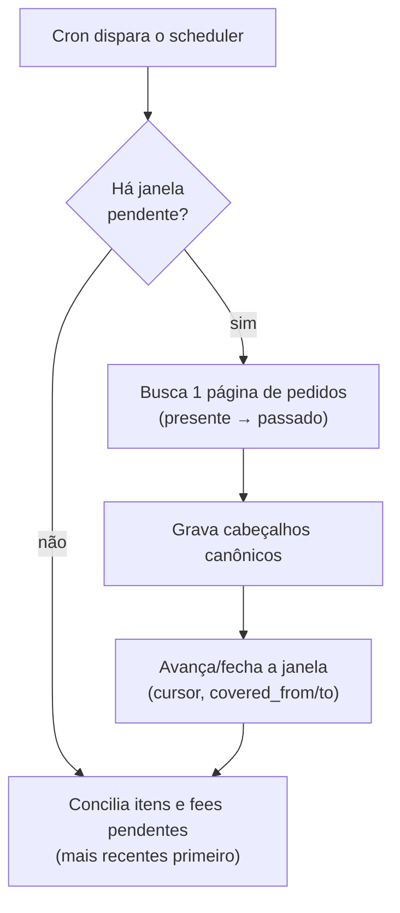
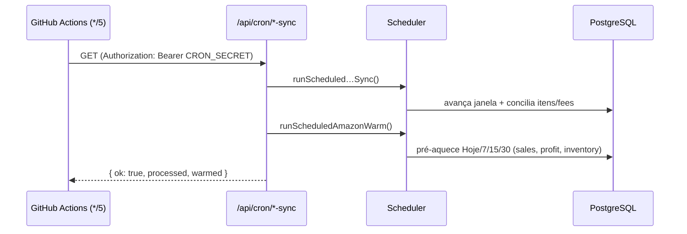
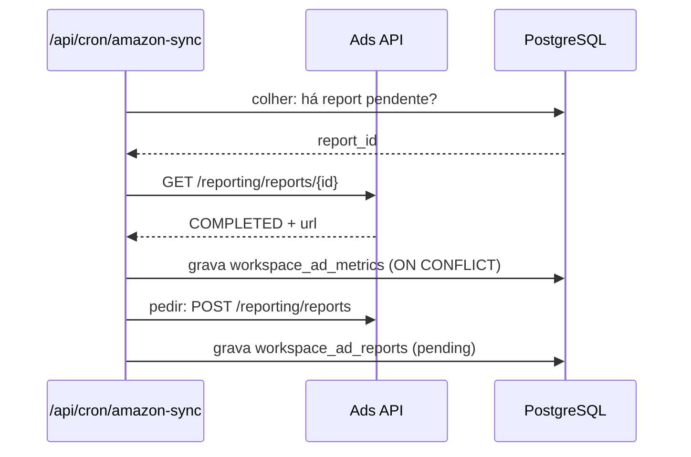

# Motor de sync (ingestão + agendamento)

> Como os dados **entram** no modelo canônico e como o processo roda em background.
> Decisão do agendador: [`../adr/ADR-003-cron-github-actions.md`](../adr/ADR-003-cron-github-actions.md).

## 1. O padrão de sync

O desenho de janela, cursor e lease é compartilhado pelos canais implementados
(`amazonSync.ts`, `mercadoLivreScheduler.ts`, `tiktokSync.ts`,
`tiktokScheduler.ts`, `shopeeSync.ts` e `shopeeScheduler.ts`). Os detalhes e
limites da API continuam específicos de cada adaptador.

- **Janela deslizante com lease.** O estado vive em `workspace_marketplace_syncs`. O
  sync caminha **do presente para o passado** em janelas (Amazon: 7 dias), guardando o
  cursor/`NextToken`. Um `lease_until` evita dois processos na mesma conta.
- **Conciliação em background.** O cabeçalho do pedido chega rápido (lista de pedidos);
  os **itens** e as **fees** chegam depois (chamadas por pedido, rate-limitadas),
  priorizando os mais recentes. Até os itens chegarem, `gross` usa o total do pedido
  como aproximação.
- **Cobertura sem extrapolar.** `covered_from`/`covered_to` marcam a janela já
  importada. Nada é "estimado" para além do que foi realmente apurado — a UI mostra
  avisos honestos de cobertura (ex.: *"cobre 1000 de 6476 vendas, sem extrapolar"*).

## 2. Agendamento — o cron

O sync e o aquecimento precisam rodar **sem depender de visita** ao dashboard.

> ⚠️ **Pegadinha do deploy:** os crons declarados em `vercel.json` **só funcionam na
> Vercel**. Como o SellerCore roda no **Render**, esse arquivo é ignorado — sem um
> agendador externo, nada dispara em background. (Ver [`ADR-003`](../adr/ADR-003-cron-github-actions.md).)

**Solução:** um workflow do **GitHub Actions** (`.github/workflows/cron.yml`) bate a
cada ~5 min nos endpoints que já existem, autenticado por `CRON_SECRET`:

- **Sync** (`amazonScheduler.ts`): avança o backfill e a conciliação das contas que
  precisam de trabalho.
- **TikTok Shop** (`tiktokScheduler.ts`, `/api/cron/tiktok-sync`): avança o sync
  paginado de pedidos/produtos e a fila financeira retomável por loja. O job
  `sync-tiktok` do workflow é independente dos jobs Amazon, para uma falha de um
  canal não impedir o outro. A implementação e seus testes não provam cobertura
  completa das categorias de settlement. A validação financeira real permanece
  parcial.
- **Shopee** (`shopeeScheduler.ts`, `/api/cron/shopee-sync`): avança o sync
  paginado de pedidos/produtos e concilia o escrow por loja. O pipeline e seus
  testes de sandbox não equivalem a validação Live, que aguarda aprovação do
  Go Live, credenciais de produção e autorização de uma loja real.
- **Anúncio** (`amazonAdsSync.ts` → `runScheduledAdsSync`, dentro de
  `/api/cron/amazon-sync`): colhe o relatório pronto e pede o próximo. Ver a
  seção abaixo — é um padrão **diferente** do resto do sync.

### 2.1 Ingestão assíncrona — o padrão do relatório

A Ads API (e os Reports da SP-API) **não respondem na hora**. Pede-se um
relatório, ele fica `PENDING` → `PROCESSING`, e só depois vira `COMPLETED` com
uma URL para baixar.

Medido em 25/08/2026, na Ads API:

| Janela pedida | Tempo até `COMPLETED` |
|---|---|
| 30 dias, granularidade diária (81 linhas) | **~11 minutos** |
| 1 dia (6 linhas) | **105 segundos** |

Nenhuma tela espera por isso. O ciclo é de **dois passos, em rodadas diferentes**:

**Três invariantes que não são estéticas:**

| | |
|---|---|
| **Colher ANTES de pedir** | colher libera a vaga do `MAX_PENDENTES`; invertido, cada rodada tentaria pedir com a vaga ocupada e só colheria na seguinte — metade da cadência de graça |
| **`MAX_PENDENTES = 1`** | pedir sem colher **entope a fila**. Foi exatamente isso que travou o extrato financeiro do TikTok por **85 rodadas** em agosto, com o cron reportando sucesso o tempo todo |
| **`PENDING` não é erro** | só `FAILED` marca falha. Tratar "ainda processando" como erro faria o cron desistir de todo relatório |

A escrita é idempotente (`ON CONFLICT … DO UPDATE`): o mesmo período é pedido
todo dia, e sem isso cada rodada duplicaria o gasto e o ACOS despencaria sozinho.

📌 A tabela de **pedidos** (`workspace_ad_reports`) existe *antes* da primeira
métrica ser gravada. Sem ela não há como saber o que já foi pedido, e o passo
vira o defeito do TikTok por construção.
- **Aquecimento** (`amazonWarm.ts`): para **todas** as contas ativas, pré-carrega os
  caches dos períodos do filtro (Hoje/7/15/30) — inclusive o KPI de Lucro — para a
  primeira visita já vir quente.

Segredos necessários: `CRON_SECRET` (no Render **e** no GitHub) e `APP_BASE_URL`
(no GitHub). Os endpoints se protegem sozinhos com esse segredo.

> **Observado em produção:** o GitHub afunila o `*/5` de repo privado para
> ~1×/hora (agendamento é best-effort). Para backfill/aquecimento é suficiente; se um
> dia precisar de sync frequente e garantido, considerar Render Cron ou pinger externo.
