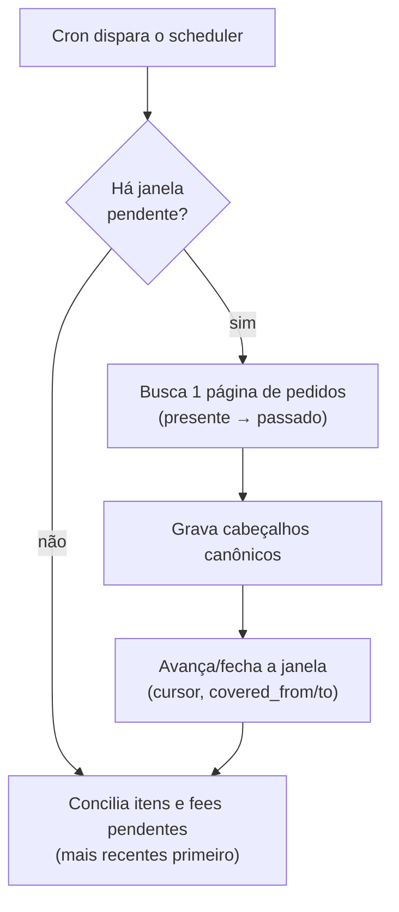
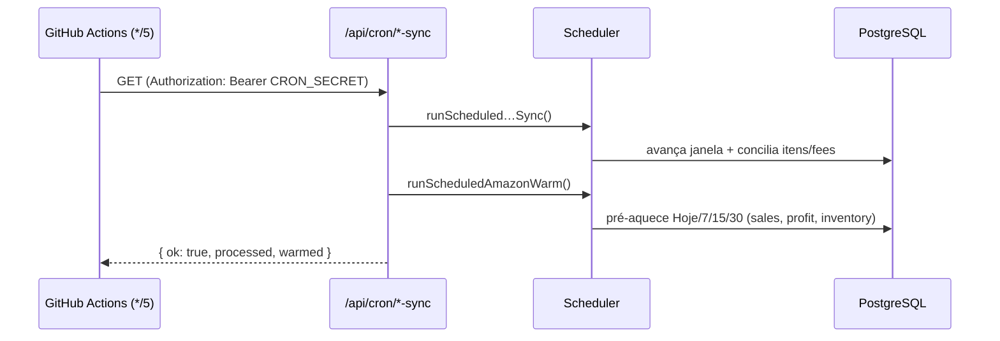

# Motor de sync (ingestão + agendamento)

> Como os dados **entram** no modelo canônico e como o processo roda em background.
> Decisão do agendador: [`../adr/ADR-003-cron-github-actions.md`](../adr/ADR-003-cron-github-actions.md).

## 1. O padrão de sync

Mesmo desenho para todo canal (`amazonSync.ts`, `mercadoLivreScheduler.ts`):

- **Janela deslizante com lease.** O estado vive em `workspace_marketplace_syncs`. O
  sync caminha **do presente para o passado** em janelas (Amazon: 7 dias), guardando o
  cursor/`NextToken`. Um `lease_until` evita dois processos na mesma conta.
- **Conciliação em background.** O cabeçalho do pedido chega rápido (lista de pedidos);
  os **itens** e as **fees** chegam depois (chamadas por pedido, rate-limitadas),
  priorizando os mais recentes. Até os itens chegarem, `gross` usa o total do pedido
  como aproximação.
- **Cobertura sem extrapolar.** `covered_from`/`covered_to` marcam a janela já
  importada. Nada é "estimado" para além do que foi realmente apurado — a UI mostra
  avisos honestos de cobertura (ex.: *"cobre 1000 de 6476 vendas, sem extrapolar"*).

## 2. Agendamento — o cron

O sync e o aquecimento precisam rodar **sem depender de visita** ao dashboard.

> ⚠️ **Pegadinha do deploy:** os crons declarados em `vercel.json` **só funcionam na
> Vercel**. Como o SellerCore roda no **Render**, esse arquivo é ignorado — sem um
> agendador externo, nada dispara em background. (Ver [`ADR-003`](../adr/ADR-003-cron-github-actions.md).)

**Solução:** um workflow do **GitHub Actions** (`.github/workflows/cron.yml`) bate a
cada ~5 min nos endpoints que já existem, autenticado por `CRON_SECRET`:

- **Sync** (`amazonScheduler.ts`): avança o backfill e a conciliação das contas que
  precisam de trabalho.
- **Aquecimento** (`amazonWarm.ts`): para **todas** as contas ativas, pré-carrega os
  caches dos períodos do filtro (Hoje/7/15/30) — inclusive o KPI de Lucro — para a
  primeira visita já vir quente.

Segredos necessários: `CRON_SECRET` (no Render **e** no GitHub) e `APP_BASE_URL`
(no GitHub). Os endpoints se protegem sozinhos com esse segredo.

> **Observado em produção:** o GitHub afunila o `*/5` de repo privado para
> ~1×/hora (agendamento é best-effort). Para backfill/aquecimento é suficiente; se um
> dia precisar de sync frequente e garantido, considerar Render Cron ou pinger externo.
